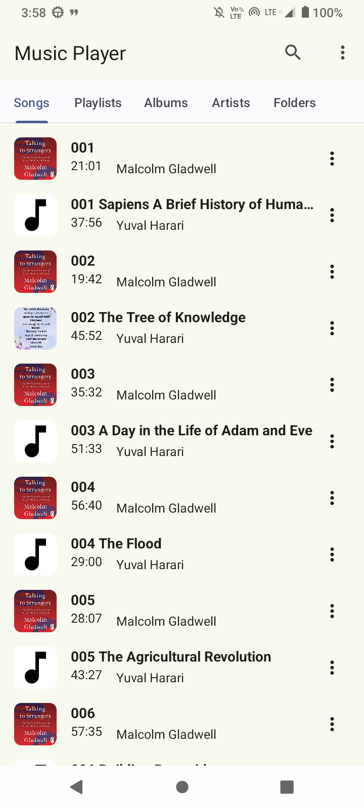
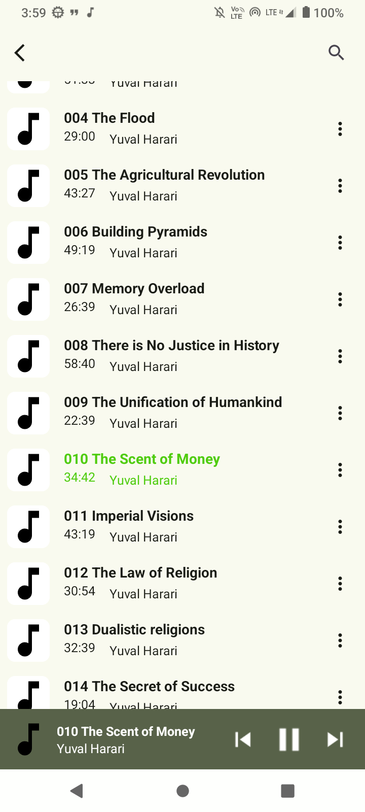
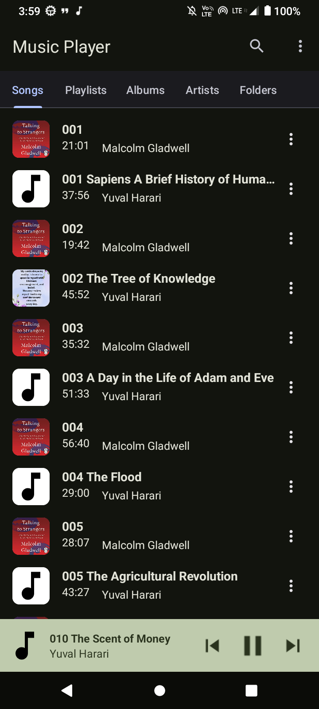
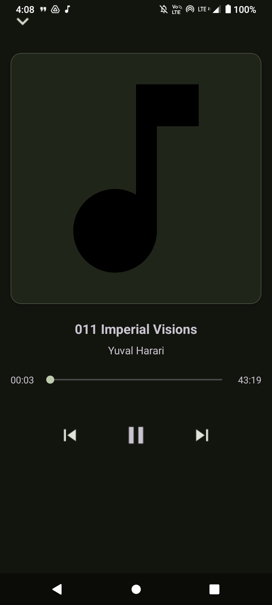
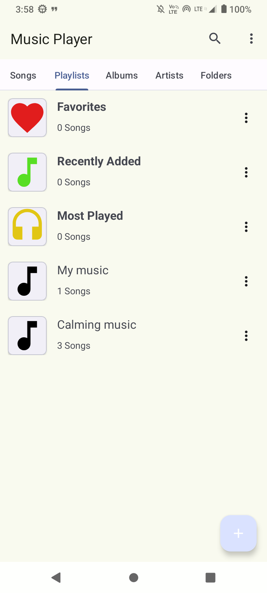
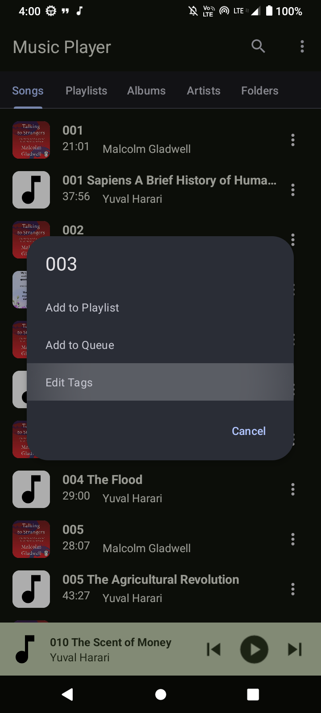
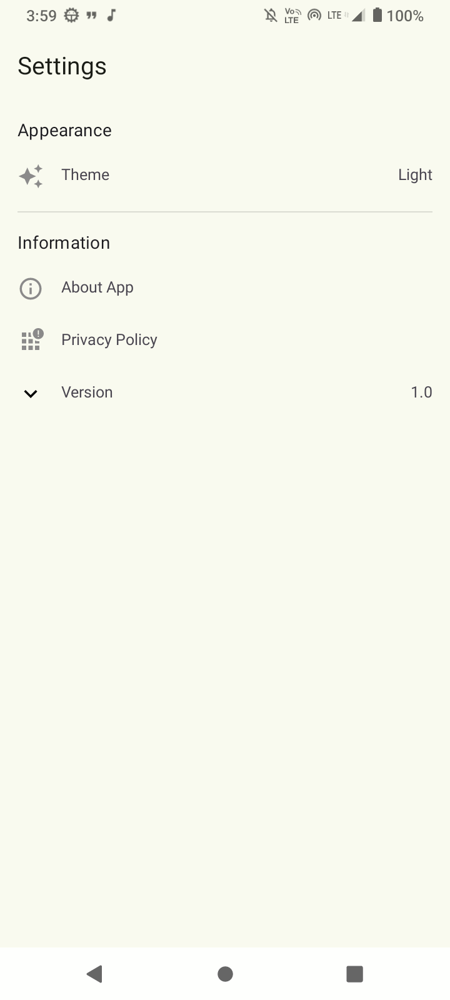
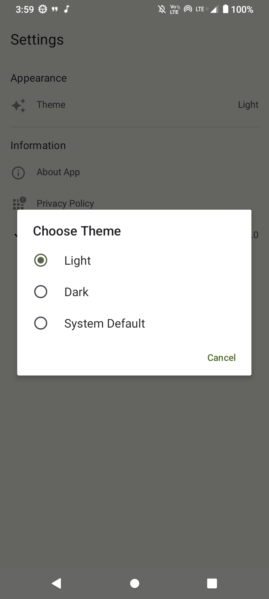

# 🎵 Music Player App

A beautifully designed Android music player built with Kotlin, MVVM architecture. This app lets
users browse, search, and play local song.

## ✨ Features

- 🎧 Play local audio files
- 🔍 Search songs by title, or artist name
- 📜 Organized song listing by playlist, album, folder and artists
- ▶️ Mini player for current song playback
- ⚙️ Built with MVVM, LiveData, ViewModel, and RecyclerView

## 📱 Screenshots

  
  
  
  
  
  
  
  

## 🛠️ Tech Stack

- Kotlin
- MVVM Architecture
- Jetpack ViewModel + LiveData
- RecyclerView
- MediaPlayer API
- Hilt for Dependency Injection

